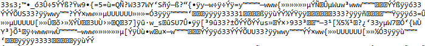
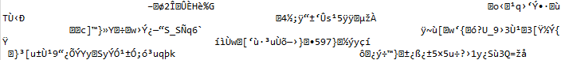
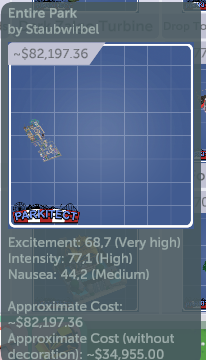

# Parkitect Blueprint Investigator

This is an investigation out of scientific curiosity of how blueprints in [Parkitect](https://store.steampowered.com/app/453090/Parkitect/) are stored. 
It started because I misspelled "castle" as "castke".

- [Step 1 - File Search](#step-1---file-search) 
- [Step 2 - Analyzing the PNG Chunks](#step-2---analyzing-the-png-chunks) 
- [Step 3 - Investigating RGB Bits](#step-3---investigating-rgb-bits) 
- [Step 4 - Finding the File Name](#step-4---finding-the-file-name) 
- [Step 5 - Using Brute Force](#step-5---using-brute-force)  


## Step 1 - File Search

First we need to find out which files contain the relevant data, so playing with the 
game brings us to this conclusion:

- blueprints are stored (on Windows) in the directory _C:\Users\<Username>\Documents\Parkitect\Saves\Blueprints_ as PNG
- if you copy one of the blueprints there, it will show up as the original name in the game and work (so the data seems to be stored in the PNG)
- however if you delete a blueprint there, it will be recreated when you next start the game (which could be due to to 
  the steam cloud synchronizing their backup of the savegames back onto your PC)
- if you delete a blueprint in game, only the PNG file will be removed in the _Saves_ directory and one byte changes in the _workshop\_files.dat_ - which seems to little to contain how the blueprint data is stored (my guess would be either a "size" field or a time stamp)

So at this point the most probable location for the blueprint data is the PNG file.


## Step 2 - Analyzing the PNG Chunks
    
<i>See [Step2ImageChunksCheck](/src/main/java/de/slothsoft/parkitect/blueprint/investigator/Step2ImageChunksCheck.java)</i>

After realizing the data is in the PNG, I did what every programmer likes to do 
- read the [PNG spec](http://www.libpng.org/pub/png/spec/1.2/PNG-Structure.html). What 
a treat!

PNG allows for custom chunk data. If this chunk data is unknown to a decoder, 
it can safely be ignored. Then an "ancillary bit" is set to true. Perfect, that's 
the chunks to put game data into.

So I created a little program to read the chunks according to spec. Running [Step2ImageChunksCheck](./src/main/java/de/slothsoft/parkitect/blueprint/investigator/Step2ImageChunksCheck.java) gets 
the following result:

```
File is really PNG.


Chunk 1
=======
Length: 13
Type: IHDR
	Ancillary bit: false


Chunk 2
=======
Length: 32768
Type: IDAT
	Ancillary bit: false


Chunk 3
=======
Length: 32768
Type: IDAT
	Ancillary bit: false


Chunk 4
=======
Length: 32768
Type: IDAT
	Ancillary bit: false


Chunk 5
=======
Length: 15089
Type: IDAT
	Ancillary bit: false


Chunk 6
=======
Length: 0
Type: IEND
	Ancillary bit: false
```

In short:

- the blueprints created in game have one IHDR, four IDAT and one IEND chunk
- the IDHR chunk is 13 bytes long and the IEND chunk 0 bytes, which is what is expected 
after reading the spec
- three of the four IDAT chunks have a length of 32768, which seems to be a limit and completely according to spec, the last chunk has a variable length
- there is no unknown chunk and no chunk with ancillary bit, which I expected to contain 
the game data

I checked the bytes of the files for the blueprint name, but couldn't find it, so in 
summary, nothing in the PNG data seems "off" in a way that screams "the game data is stored here". 

Great, now what?


# Step 3 - Investigating RGB Bits

<i>See [Step3RgbDataCheck](/src/main/java/de/slothsoft/parkitect/blueprint/investigator/Step3RgbDataCheck.java)</i>

A [question on Reddit](https://www.reddit.com/r/ThemeParkitect/comments/qpa35q/how_are_blueprints_stored/) 
revealed that the developers of Parkitect wrote about the subject: [Update 58](https://themeparkitect.tumblr.com/post/126855975857/update-58)

They explained the reason for not using custom chunks is that these are often removed 
by overzealous decoder, e.g. the ones used by uploaders on Tumbler.

So instead of using custom chunks, they used the last bits of the RGB fields. Very, 
very clever.

Since the Tumblr post is six years old, the first check is to see if my blueprints still 
contain the artifacts that show that the bit values of RGB are used:


	
They do.

So I created a programm to get the last bits of the RGB values and print them to console. Running 
will print:

<kbd></kbd>

...which looks like it could be game data. Or it's random. At least it looks like the 
last bytes are a repeating sequence, but that might be because it's the same color in 
the picture.

Just to be sure I ran the same programm over this GitHub profile picture, and the result 
is:

<kbd></kbd>

...which looks a lot less like game data. 

However, if I search the blueprint file's data for the blueprint's name, which I know 
is there, then nothing is found. So either my algorithm is wrong, the last two 
bits (instead of last bit) is used, the order of the bits is incorrect or... the name is not 
stored in an ASCII representation.


# Step 4 - Finding the File Name

<i>See [Step4OneBitSearchCheck](/src/main/java/de/slothsoft/parkitect/blueprint/investigator/Step4OneBitSearchCheck.java), [Step4TwoBitSearchCheck](/src/main/java/de/slothsoft/parkitect/blueprint/investigator/Step4TwoBitSearchCheck.java)</i>


At this point it's clear the only things to do to figure this puzzle out is to

1. ask the persons that created the format
1. try to brute force my way in

Brute forcing could work via the assumption that the blueprint name is stored somewhere in
the image (which can easily be proven by copying or renaming the file - the new copy has the same name as the
original, even though its file name differs).

So I created two classes that search for bytes with the same amount of ones as in the characters
of the blueprint name. 

No matter if I use the last bit ([Step4OneBitSearchCheck](/src/main/java/de/slothsoft/parkitect/blueprint/investigator/Step4OneBitSearchCheck.java)) 
or the last two bits ([Step4TwoBitSearchCheck](/src/main/java/de/slothsoft/parkitect/blueprint/investigator/Step4TwoBitSearchCheck.java)),
the blueprint name cannot be found.

Even if I fiddle with the order of the bits (not RGBA as in the Tumblr post, but ARGB or even
more outlandish combinations), I can't find the name. 

Maybe the encoding of the name is the problem...?


# Step 5 - Using Brute Force

<i>See [Step5BruteForce](/src/main/java/de/slothsoft/parkitect/blueprint/investigator/Step5BruteForce.java)</i>

So which encoding does the blueprints use? Hard to say. They could use some custom format, 
which is unlikely if a lot of characters are supported. So back in the game I tried to figure out
if symbols and umlauts are allowed. The result:


So it's not ASCII. But it is bound by the actual file name, because by default file name and blueprint 
name are the same. So which format do OS use?

Windows seems to use UTF-16, Mac and Linux UTF-8, so checking for UTF-8 should work better.

Second question: are one or two bits used for storing data? To figure that out I checked the color 
values of the top left pixels of the castle blueprint, which should be the same color. The values are:

(It's RGBA)

```
415B90FE 415A91FE 415A91FF 405A91FE 415A90FE
415B90FF 405B91FF 415A91FE 405A91FF 415A91FF
405B90FF 405B91FF 415A91FF 415B90FE 405B91FF
```

So the red of the "same" color is 41 or 40, green is 5A or 5B, blue is 90 or 91 and alpha is FF or FE. 
All of these only differ by one bit, so it's probable only the last bit of each color component is used.

With these two assumption we can build a brute force algorithm that tries all combinations of these 
four bits to try to find our UTF-8 encoded blueprint name.

Oh, and now we have data to compare against - the above bits should be:

```
1100 1010 1011 0010 1000
1101 0111 1010 0011 1011
0101 0111 1010 1100 0111
```

...or...

```
C A B 2 8
D 7 A 3 B
5 7 A C 7
```


## Result

Since I could not compare the bytes against the expected data, I realized I had accidentally switched x and y while building the bytes.

But neither the incorrect nor the correct version produced the bytes of the blueprint names in [Step5BruteForce](/src/main/java/de/slothsoft/parkitect/blueprint/investigator/Step5BruteForce.java).

So that was a bust, however using the RGBA bits I realized the first 3 bytes of the blueprints were always the same (that is of course true for every
combination of bits, not just RGBA):

```
1100 1010
1011 0010
1000 0000
```

Which means they could be a tag (like NAME followed by the bytes for the name) or maybe some marker bytes to let the decoder know it's a Parkitect 
blueprint file.
 


# Step 6 - Cracking the Code

<i>See [Step6PrintData](/src/main/java/de/slothsoft/parkitect/blueprint/investigator/Step6PrintData.java)</i>

So what could this mean?

```
1100 1010
1011 0010
1000 0000
```

I checked the [UTF-8 table](https://www.utf8-chartable.de/) and found something intriguing - P is 50 which is 110010 binary, the first 
6 bits of the code. C is 43 / 101011, 001010 is a control character without fix meaning and 000000 is zero. PC could stand for Parkitect, 
or it could be a random coincident. But maybe the reason why I couldn't find the blueprint name in the color component's bit data
is because it is not neatly byte separated.

So let's approach this from the other direction, now that we are confident which order of bytes to use. What data is encoded in these blueprints?

Let's take a look at what the game displays of the blueprint. For that I took a blueprint of my entire park: 



The name, obviously, is in there; we've been searching for it for a while now. The name of the creator is in there, too. 
Height, width and length might make sense, but since I could create a blueprint of my entire park, which would blow up
that field and because it's not in the info I suspect there are not. The values for excitement, intensity and nausea, and
the costs are present as well, even though if there are stored as something like a double, they're harder to find. I'd store
them as integers (and move the decimal separator when displaying them), so maybe we are lucky. Finally, of course there should be 
a list of game objects with their coordinates (x, y, z, rotation and size at least).

We can probably pinpoint the positions of these things by creating blueprints that are identical except for one of these components.

The [identical](/blueprints/identical) folder contains such blueprints. The problem: Even _flower-1.png_ and _flower-2.png_, which only
contain one identical game object, differ widely. 

Which means there are some additional bytes or bits or maybe there is a 
timestamp of some sort.
What could that mean?

- these bytes could contain a timestamp of sorts (but this would be a really long timestamp)
- these bytes could contain random data, because they are never used 
  (but  there are a lot of random bytes in the middle of data)
- these bytes could contain random data, because they are not used for the blueprint in question - namely they could be for excitement, intensity and nausea
- the format used is dynamic, e.g. key-value-pairs, and so it's the same data in another order

So I created two blueprints with the same ride, so that excitement etc. would be set, but about the same amount (if not more) of
the data differed between these two, so that leaves us with a dynamic format.

Since [Step6PrintData](/src/main/java/de/slothsoft/parkitect/blueprint/investigator/Step6PrintData.java) gave me the option to get a bit stream,
I searched that stream for the blueprint name and creator name again, in UTF-8 and ASCII, and I came back empty handed.

Well, not entirely empty handed - I realized I had made a mistake. The first six bytes, which I thought was P because it's 50 were wrong. Because P 
is 50 in hexadecimal, so it's 80 decimal and 1010000. So back to the drawing board. Sadly, at this point I'm all out of ideas.

